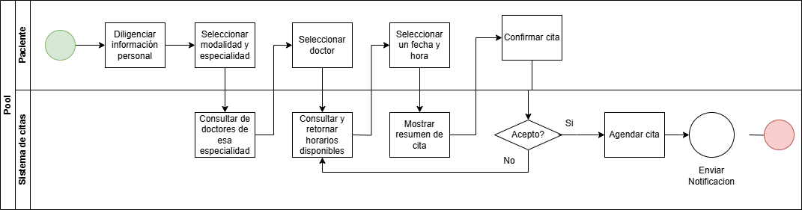

# 🗒️ Registro de Trabajo en Clase - Taller X

## 📆 Fecha de la sesión
07/02/2026

## 👥 Integrantes presentes
- Carlos David Bello Ortiz
- Jonatan David Vergara Suarez
- Jhojan camilo Jiménez Amaya

## 🧠 Actividades realizadas en clase

Se discutió quienes serían los actores, que datos requerirían acciones del sistema de 
citas para hacer la búsqueda y cuales requerirían validación para continuar, se 
concluyó que la decisión que se tomaría seria al final del proceso para aceptar la cita 
agendada en caso de ser la deseada y si no se realizó la corrección por observación 
del docente al rechazar el agendar la cita a seleccionar doctor debido a que si no 
consigue cita con su médico de preferencia pasaría a cambiar de médico o 
modalidad de la cita, también se corrigió el uso de acción para “enviar notificación” y 
que anteriormente se tenía como paso el aceptar la cita y seleccionar el método de 
notificación para posteriormente el sistema agendar la cita. 

## 🧩 Boceto inicial del modelo

## 🔁 Tareas definidas para complementar el taller

Anote las responsabilidades acordadas entre los miembros del equipo para completar la entrega final:

| Tarea asignada | Responsable | Fecha estimada |
|----------------|-------------|----------------|
| Modelado final en draw.io | Jonatan Vergara | 07/02 |
| Redacción del informe     | Carlos Bello | 07/02 |
| Investigación y referencias | Jhojan Jiménez | 07/02 |

---

_Este documento resume el trabajo colaborativo realizado durante la sesión del taller X en el curso AREM - Universidad de La Sabana._